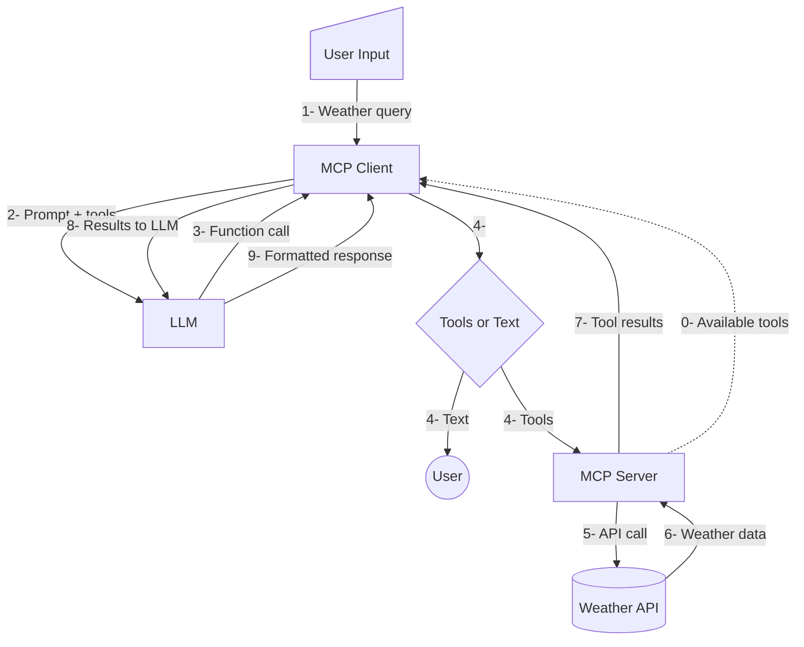

```mermaid
graph TD;
    A@{ shape: manual-input, label: "User Input" } -->|1- Weather query| B[MCP Client];
    B -->|2- Prompt + tools| C[LLM];
    C -->|3- Function call| B;
    B -->|4-| G{Tools or Text};
    G -->|4- Text| F@{ shape: circle, label: "User" };
    G -->|4- Tools|D[MCP Server];
    D -->|5- API call| E@{ shape: cyl, label: "Weather API" };
    E -->|6- Weather data| D;
    D -->|7- Tool results| B;
    B -->|8- Results to LLM| C;
    C -->|9- Formatted response| B;
    D -.->|0- Available tools| B;
```

- [SSE Version README](SSE/README-SSE.md)
- [WebSocket Version README](WS/README-WS.MD)

