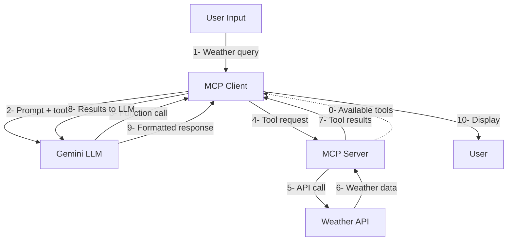

```mermaid
graph TD;
    A[User Input] -->|1- Weather query| B[MCP Client]
    B -->|2- Prompt + tools| C[Gemini LLM]
    C -->|3- Function call| B
    B -->|4- Tool request| D[MCP Server]
    D -->|5- API call| E[Weather API]
    E -->|6- Weather data| D
    D -->|7- Tool results| B
    B -->|8- Results to LLM| C
    C -->|9- Formatted response| B
    B -->|10- Display| F[User]
    
    D -.->|0- Available tools| B
```