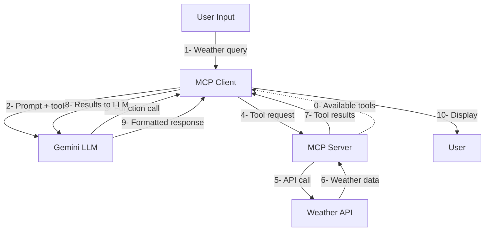

# MCP Weather Demo

A demonstration of the Model Context Protocol (MCP) featuring a React client that connects to an MCP server with weather tools via WebSocket, integrated with Google Gemini AI.

## Project Structure

```
mcp-full/
├── mcp-server/          # Python MCP server with weather tools
│   ├── mcp_server.py    # FastMCP server implementation
│   ├── requirements.txt # Python dependencies
│   └── venv/           # Python virtual environment
└── pwa-mcp/            # React Progressive Web App client
    ├── src/
    │   ├── services/   # WebSocket and Gemini API services
    │   └── App.tsx     # Main application component
    └── package.json    # Node.js dependencies
```

## Features

- **MCP Server**: Python server providing weather forecast tools using National Weather Service API
- **WebSocket Communication**: Real-time bidirectional communication between client and server
- **AI Integration**: Google Gemini AI with function calling capabilities
- **Weather Tools**: Get weather forecasts by coordinates with location name support
- **Progressive Web App**: React-based client with offline capabilities

## Prerequisites

- **Node.js** (v16 or higher)
- **Python 3.8+** 
- **Google Gemini API Key** ([Get one here](https://makersuite.google.com/app/apikey))

## Setup Instructions

### 1. MCP Server Setup

Navigate to the server directory:
```bash
cd mcp-server
```

Activate the virtual environment:
```bash
source venv/bin/activate
```

Install dependencies (if not already installed):
```bash
pip install -r requirements.txt
```

Start the MCP server:
```bash
python mcp_server.py
```

The server will start on `localhost:8765` and provide:
- `get_weather_forecast(latitude, longitude)` - Get 7-day weather forecast

### 2. React Client Setup

Navigate to the client directory:
```bash
cd pwa-mcp
```

Install dependencies:
```bash
npm install
```

Configure your Gemini API key (required):
```bash
# Copy the example environment file
cp .env.example .env

# Edit .env and add your Gemini API key
# VITE_GEMINI_API_KEY=your_actual_api_key_here
```

Start the development server:
```bash
npm run dev
```

The client will start on `http://localhost:5174` (or another port if 5174 is in use).

## Usage

1. **Start both servers** (MCP server on :8765, React client on :5174)
2. **Open the React app** in your browser
3. **Wait for connection** - You should see "Connected (2 tools available)" in the header
4. **Ask for weather**: Type a query like:
   - "Get weather forecast for Providence RI"
   - "What's the weather like in Boston MA?" 
   - "Show me the forecast for New York City"
   - "Are there any weather alerts in California?"
   - "Show me weather warnings for Texas"

## How It Works

### MCP Flow
1. **User Query** → React app sends prompt to Gemini with available MCP tools
2. **Gemini Processing** → AI decides if it needs to use weather tools and extracts coordinates
3. **Tool Execution** → If tools needed, React app sends requests to MCP server via WebSocket
4. **Data Retrieval** → MCP server calls National Weather Service API and returns weather data
5. **Final Response** → Tool results sent back to Gemini for natural language response
6. **Display** → Formatted weather information shown to user

### Architecture
```
User ↔ React Client ↔ WebSocket ↔ MCP Server ↔ Weather API
         ↕
    Gemini AI API
```

## Available Tools

### `get_weather_forecast`
- **Description**: Get weather forecast for given coordinates
- **Parameters**: 
  - `latitude` (float): Latitude (-90 to 90)
  - `longitude` (float): Longitude (-180 to 180)
- **Returns**: 7-day weather forecast with temperature, wind, and conditions

The tool description includes example coordinates for major cities, allowing Gemini to convert location names to coordinates automatically.

### `get_weather_alerts`
- **Description**: Get active weather alerts for US states
- **Parameters**:
  - `state` (string): 2-letter US state code (e.g., CA, TX, FL, NY, RI)
- **Returns**: List of active weather alerts including headline, severity, urgency, and description

Use this tool when users ask about weather alerts, warnings, watches, or emergency weather conditions.

## Development

### Running Tests
```bash
# Client tests
cd pwa-mcp
npm run test

# Server tests
cd mcp-server
python -m pytest
```

### Building for Production
```bash
# Build React app
cd pwa-mcp
npm run build

# Serve production build
npm run preview
```

### Debugging
- **Browser Console**: Check for WebSocket connection and API call logs
- **MCP Server Logs**: Server outputs detailed request/response information
- **Debug Panel**: Expand "Debug: MCP Messages" in the client to see raw MCP communication

## Troubleshooting

### Common Issues

**"Disconnected - Check MCP server"**
- Ensure MCP server is running on localhost:8765
- Check that virtual environment is activated
- Verify all Python dependencies are installed

**"No response received from Gemini"**
- Ensure you've created `.env` file with valid `VITE_GEMINI_API_KEY`
- Check your Gemini API key is valid and has proper permissions
- Verify internet connection
- Look for API rate limiting errors in console

**"WebSocket connection failed"**
- Ensure both client and server are running
- Check for port conflicts (8765 for server, 5174 for client)
- Verify firewall settings allow localhost connections

**Tool calls not working**
- For forecasts: Ask for "weather forecast" with a specific location
- For alerts: Ask for "weather alerts" with a US state name
- Include a specific location or state in your query
- Check browser console for detailed error messages

## Security Notes

- **Never commit your `.env` file** - it contains your API key
- API keys are included in the client bundle when built (standard for client-side apps)
- For production use, consider implementing API proxy servers
- Consider rate limiting and authentication for the MCP server
- Regularly rotate your API keys for security

## Contributing

1. Fork the repository
2. Create a feature branch
3. Make your changes
4. Test both client and server
5. Submit a pull request

## License

MIT License - See LICENSE file for details
