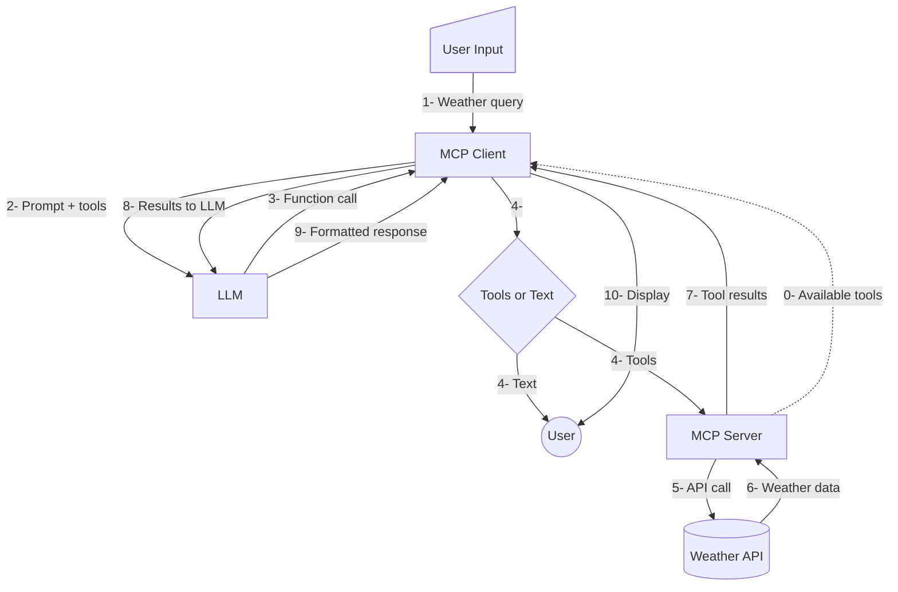

# Complete MCP Protocol Demo

A comprehensive demonstration of the Model Context Protocol (MCP) featuring all major protocol components: **Tools**, **Resources**, **Dynamic Resource Templates**, and **Prompt Templates**. This React client connects to an MCP server via WebSocket and integrates with Google Gemini AI to showcase the full MCP ecosystem.

## Project Structure

```
mcp-full/
├── mcp-server/              # Python MCP server with comprehensive MCP features
│   ├── mcp_server.py        # FastMCP server implementation
│   ├── requirements.txt     # Python dependencies
│   ├── resources/           # Static resource files
│   │   ├── dolphin.txt      # Animal resource files
│   │   ├── elephant.txt
│   │   ├── lion.txt
│   │   └── cloudwhale.txt   # Unique demo resource
│   └── venv/               # Python virtual environment
└── pwa-mcp/                # React Progressive Web App client
    ├── src/
    │   ├── services/       # WebSocket and Gemini API services
    │   │   ├── websocket.ts
    │   │   └── gemini.ts
    │   ├── App.tsx         # Main application component
    │   └── App.css         # Styling with prompt template UI
    └── package.json        # Node.js dependencies
```

## Features

### 🔧 **MCP Tools**
- **Weather Forecasts**: Get 7-day weather forecasts using National Weather Service API
- **Weather Alerts**: Active weather alerts, warnings, and watches by US state
- **Coordinate Resolution**: Intelligent location-to-coordinate conversion

### 📁 **MCP Resources**
- **Static Resources**: Animal information files (dolphin, elephant, lion, cloudwhale)
- **Resource Discovery**: Automatic resource listing and metadata
- **Custom URI Schemes**: `animal://` and `resource://` URI support

### 🎯 **Dynamic Resource Templates**
- **Weather Reports**: `weather://report/{location}/{days}` - Dynamic weather reports
- **Animal Facts**: `animal://facts/{species}/{category}` - Categorized animal information
- **Climate Data**: `climate://{location}/{year}/{month}` - Historical climate data
- **Parameter Validation**: Smart validation and error handling for all templates

### 📝 **Prompt Templates**
- **Weather Briefing**: Comprehensive weather analysis with alerts
- **Animal Profile**: Educational animal profiles with focus areas
- **Habitat Weather**: Combined animal habitat and weather analysis
- **Travel Wildlife Briefing**: Travel planning with weather and wildlife info

### 🌐 **Client Features**
- **WebSocket Communication**: Real-time bidirectional MCP protocol communication
- **AI Integration**: Google Gemini AI with advanced function calling
- **Interactive UI**: Beautiful prompt template buttons and dynamic examples
- **Progressive Web App**: React-based client with offline capabilities
- **Real-time Status**: Live connection status with tool/resource/prompt counts

## Prerequisites

- **Node.js** (v16 or higher)
- **Python 3.8+** 
- **Google Gemini API Key** ([Get one here](https://makersuite.google.com/app/apikey))

## Setup Instructions

### 1. MCP Server Setup

Navigate to the server directory:
```bash
cd mcp-server
```

Activate the virtual environment:
```bash
source venv/bin/activate
```

Install dependencies (if not already installed):
```bash
pip install -r requirements.txt
```

Start the MCP server:
```bash
python mcp_server.py
```

The server will start on `localhost:8765` and provide:
- **2 Tools**: `get_weather_forecast`, `get_weather_alerts`
- **4 Static Resources**: Animal information files
- **3 Dynamic Resource Templates**: Weather reports, animal facts, climate data
- **4 Prompt Templates**: Weather briefing, animal profile, habitat weather, travel briefing

### 2. React Client Setup

Navigate to the client directory:
```bash
cd pwa-mcp
```

Install dependencies:
```bash
npm install
```

Configure your Gemini API key (required):
```bash
# Copy the example environment file
cp .env.example .env

# Edit .env and add your Gemini API key
# VITE_GEMINI_API_KEY=your_actual_api_key_here
```

Start the development server:
```bash
npm run dev
```

The client will start on `http://localhost:5174` (or another port if 5174 is in use).

## Usage

1. **Start both servers** (MCP server on :8765, React client on :5174)
2. **Open the React app** in your browser
3. **Wait for connection** - You should see "Connected (2 tools, 4 resources, 4 prompts available)" in the header
4. **Try these examples**:

   **🌤️ Weather Queries:**
   - "Get weather forecast for Providence RI"
   - "What's the weather like in Boston MA?"
   - "Are there any weather alerts in California?"
   - "Generate a 5-day weather report for Chicago"

   **🐋 Animal Information:**
   - "Tell me about dolphins"
   - "What are cloudwhale conservation facts?"
   - "Show me elephant behavior information"
   - "Tell me about lion habitat facts"

   **📊 Climate Data:**
   - "Show me climate data for Boston in January 2023"
   - "What was the weather like in New York in July 2022?"

   **🎯 Prompt Templates:**
   - Click any prompt template button to load structured prompts
   - Modify the loaded prompt before sending to customize your request

   **💡 Unique Demo Features:**
   - Ask about **Cloudwhales** - a mythical creature that exists only in our MCP resources!
   - Try dynamic resource templates that generate content on-demand
   - Use prompt templates for structured, professional responses

## How It Works

### MCP Flow
1. **User Query** → React app sends prompt to Gemini with available MCP tools
2. **Gemini Processing** → AI decides if it needs to use weather tools and extracts coordinates
3. **Tool Execution** → If tools needed, React app sends requests to MCP server via WebSocket
4. **Data Retrieval** → MCP server calls National Weather Service API and returns weather data
5. **Final Response** → Tool results sent back to Gemini for natural language response
6. **Display** → Formatted weather information shown to user

### Architecture
```
User ↔ React Client ↔ WebSocket ↔ MCP Server ↔ Weather API
         ↕
    Gemini AI API
```

## MCP Protocol Components

This demo showcases all major MCP protocol features:

### 🔧 **Tools**

#### `get_weather_forecast`
- **Description**: Get weather forecast for given coordinates
- **Parameters**: 
  - `latitude` (float): Latitude (-90 to 90)
  - `longitude` (float): Longitude (-180 to 180)
- **Returns**: 7-day weather forecast with temperature, wind, and conditions

#### `get_weather_alerts`
- **Description**: Get active weather alerts for US states
- **Parameters**:
  - `state` (string): 2-letter US state code (e.g., CA, TX, FL, NY, RI)
- **Returns**: List of active weather alerts including headline, severity, urgency, and description

### 📁 **Static Resources**

#### `animal://{animal_name}`
- **Available Animals**: `dolphin`, `elephant`, `lion`, `cloudwhale`
- **Description**: Static text files containing detailed animal information
- **Examples**: 
  - `animal://dolphin` - Dolphin facts and characteristics
  - `animal://cloudwhale` - Unique mythical creature (demo-only)

#### `resource://about`
- **Description**: Server information and available resource list
- **Returns**: Server metadata and resource inventory

### 🎯 **Dynamic Resource Templates**

#### `weather://report/{location}/{days}`
- **Description**: Generate dynamic weather reports for any location and timeframe
- **Parameters**:
  - `location`: Supported locations (providence-ri, boston-ma, new-york-ny, los-angeles-ca, chicago-il)
  - `days`: Number of days for forecast (1-14)
- **Example**: `weather://report/boston-ma/7`

#### `animal://facts/{species}/{category}`
- **Description**: Get specific facts about animals by category
- **Parameters**:
  - `species`: Animal species (dolphin, elephant, lion, cloudwhale)
  - `category`: Fact category (habitat, diet, behavior, conservation, physical, reproduction)
- **Example**: `animal://facts/cloudwhale/habitat`

#### `climate://{location}/{year}/{month}`
- **Description**: Historical climate data for specific locations and dates
- **Parameters**:
  - `location`: Location name
  - `year`: Year (1900-2024)
  - `month`: Month (1-12)
- **Example**: `climate://Providence-RI/2024/07`

### 📝 **Prompt Templates**

#### `weather_briefing`
- **Description**: Generate comprehensive weather briefing for a location
- **Parameters**:
  - `location`: Location for weather briefing
  - `include_alerts`: Whether to include weather alerts (default: true)

#### `animal_profile`
- **Description**: Create detailed educational profile for an animal
- **Parameters**:
  - `animal_name`: Animal name (dolphin, elephant, lion, cloudwhale)
  - `focus`: Focus area (general, habitat, behavior, conservation)

#### `habitat_weather`
- **Description**: Combine animal habitat info with current weather conditions
- **Parameters**:
  - `animal_name`: Animal name
  - `location`: Geographic location for weather analysis

#### `travel_wildlife_briefing`
- **Description**: Travel briefing combining weather and wildlife information
- **Parameters**:
  - `destination`: Travel destination
  - `season`: Season focus (current, spring, summer, fall, winter)

## 🌟 Demo Highlights

### **Complete MCP Implementation**
This demo is a **comprehensive showcase** of the Model Context Protocol, featuring all major components:
- ✅ **Tools** - Live weather data from National Weather Service API
- ✅ **Static Resources** - Animal information files from local storage
- ✅ **Dynamic Resource Templates** - On-demand content generation
- ✅ **Prompt Templates** - Reusable AI prompt workflows

### **Unique Features**
- **🐋 Cloudwhales**: A mythical creature that exists **only** in our MCP resources, demonstrating that the system accesses local files rather than external APIs
- **🎯 Resource Templates**: Dynamic URI resolution showing `weather://report/boston-ma/7` → generated content
- **📝 Interactive Prompts**: Click-to-load prompt templates with smart defaults
- **🔄 Real-time Protocol**: Live WebSocket MCP communication with full message logging

### **Educational Value**
- **Protocol Learning**: See exactly how MCP tools, resources, and prompts work together
- **Local vs Remote**: Compare static files vs dynamic generation vs API calls
- **AI Integration**: Watch Gemini intelligently choose and combine different MCP components
- **Scalable Patterns**: Templates show how to create infinite content combinations

## Development

### Running Tests
```bash
# Client tests
cd pwa-mcp
npm run test

# Server tests
cd mcp-server
python -m pytest
```

### Building for Production
```bash
# Build React app
cd pwa-mcp
npm run build

# Serve production build
npm run preview
```

### Debugging
- **Browser Console**: Check for WebSocket connection and API call logs
- **MCP Server Logs**: Server outputs detailed request/response information
- **Debug Panel**: Expand "Debug: MCP Messages" in the client to see raw MCP communication

## Troubleshooting

### Common Issues

**"Disconnected - Check MCP server"**
- Ensure MCP server is running on localhost:8765
- Check that virtual environment is activated
- Verify all Python dependencies are installed

**"No response received from Gemini"**
- Ensure you've created `.env` file with valid `VITE_GEMINI_API_KEY`
- Check your Gemini API key is valid and has proper permissions
- Verify internet connection
- Look for API rate limiting errors in console

**"WebSocket connection failed"**
- Ensure both client and server are running
- Check for port conflicts (8765 for server, 5174 for client)
- Verify firewall settings allow localhost connections

**Tool calls not working**
- For forecasts: Ask for "weather forecast" with a specific location
- For alerts: Ask for "weather alerts" with a US state name
- For resources: Try "Tell me about cloudwhales" or "Show me dolphin facts"
- For dynamic resources: Try "Generate 5-day weather report for Boston" 
- For prompt templates: Click the template buttons or ask for structured responses
- Include specific locations/parameters in your queries
- Check browser console for detailed error messages

**Resources not loading**
- Verify `resources/` folder exists in `mcp-server/` directory
- Check that animal files (dolphin.txt, cloudwhale.txt, etc.) are present
- Look for "Resources list response" in browser console debug panel

**Prompt templates not appearing**
- Ensure you see "X prompts available" in the connection status
- Check that prompt template buttons appear below the header
- Try refreshing the page if templates don't load initially

**Dynamic resources failing**
- Verify parameter format (e.g., "boston-ma" not "Boston, MA")
- Check supported date ranges (1900-2024 for climate data)
- Use valid categories for animal facts (habitat, diet, behavior, etc.)

## Security Notes

- **Never commit your `.env` file** - it contains your API key
- API keys are included in the client bundle when built (standard for client-side apps)
- For production use, consider implementing API proxy servers
- Consider rate limiting and authentication for the MCP server
- Regularly rotate your API keys for security

## 🚀 Getting Started

1. **Clone the repository**
2. **Follow setup instructions** for both MCP server and React client
3. **Start both servers** and visit http://localhost:5174
4. **Try the examples** to see all MCP protocol components in action
5. **Explore the code** to understand MCP implementation patterns

## Contributing

1. Fork the repository
2. Create a feature branch
3. Make your changes
4. Test both client and server with all MCP components
5. Submit a pull request

## About This Demo

This project serves as a **complete reference implementation** of the Model Context Protocol, showcasing:
- Real-world integration patterns between MCP servers and AI clients
- All major MCP protocol components working together seamlessly  
- Best practices for WebSocket communication and resource management
- Educational examples that demonstrate both simple and advanced MCP features

Perfect for developers learning MCP or building their own MCP-enabled applications! 🎉

## License

MIT License - See LICENSE file for details
